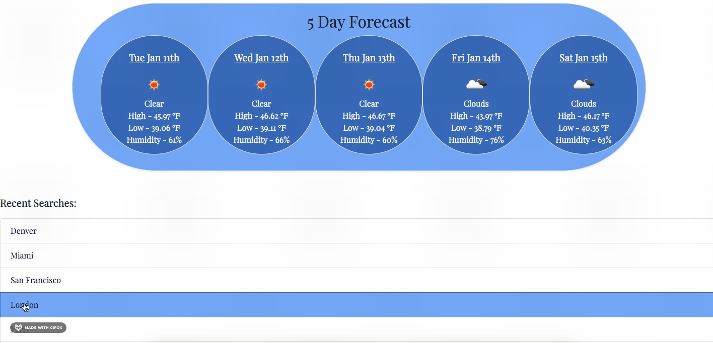

# Weather Dashboard

This page is a weather dashboard allowing the user to search any city and see the current weather conditions, temperature, wind speed, and UV index. UV index is color coordinated as follows: Green (low), Yellow (mild), Orange (moderate), Red (high), Purple (extreme). A 5 day forecast will also be displayed showing day of the week, date, weather condition, temperature high, temperature low, and humidity. Search history is saved at the bottom of the page as an ongoing list. Prior searches can be clicked from the list and will re-populate the page with data from that city.

## Getting Started

* User enters the page and enters a city name into the search form
* After submitting the form, the user will be shown local weather, as well as a 5 day weather forecast
* User can continue entering and submitting different cities into search bar as many times as they wish without refreshing the page
* Search history populates list at the bottom of the page
    * List items are clickable and will re-submit the search for that city

## Essential Code

*
*
*
*
*
*
*

## Built With

* [HTML](https://developer.mozilla.org/en-US/docs/Web/HTML)
* [CSS](https://developer.mozilla.org/en-US/docs/Web/CSS)
* [Javascript](https://developer.mozilla.org/en-US/docs/Web/JavaScript)
* [JQuery](https://developer.mozilla.org/en-US/docs/Glossary/jQuery)
* [Bootstrap CSS Framework](https://getbootstrap.com/)
* [Google Fonts](https://fonts.google.com/)
* [Open Weather API](https://openweathermap.org/api)
* [Flat Icon Royalty Free Images](https://www.flaticon.com/)

## Deployed Link

* [See Live Site](https://cfoster121.github.io/weather-dashboard/)

## Author

* **Courtney Foster** 

- [Link to Portfolio Site](https://cfoster121.github.io/homework2/)
- [Link to Github](https://github.com/cfoster121)
- [Link to LinkedIn](https://www.linkedin.com/in/courtney-foster-0b364575/)

## Acknowledgments

* [W3 Schools](https://www.w3schools.com/)
* [MDN Web Docs](https://developer.mozilla.org/en-US/)
* [Gif Application](https://gifox.io/)
* [Markdown Preview](https://dillinger.io/)
* TA / Tutor sessions
